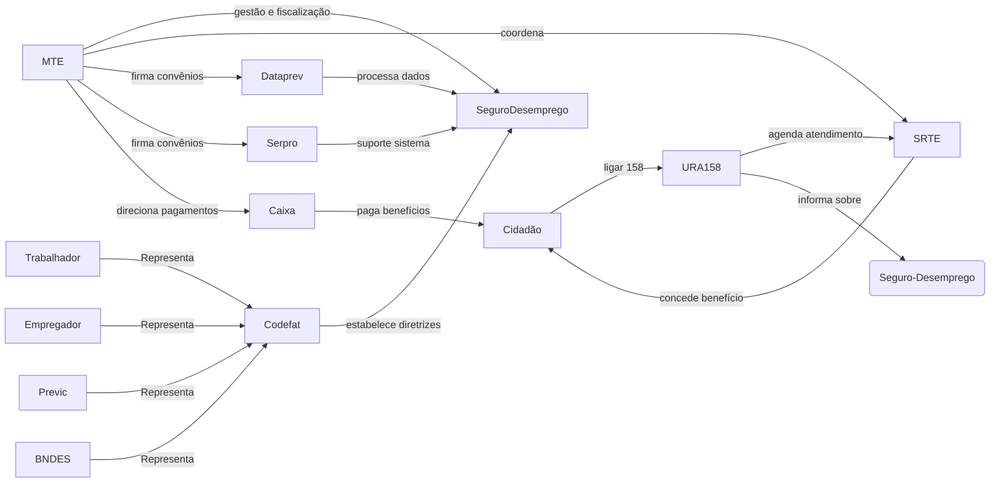
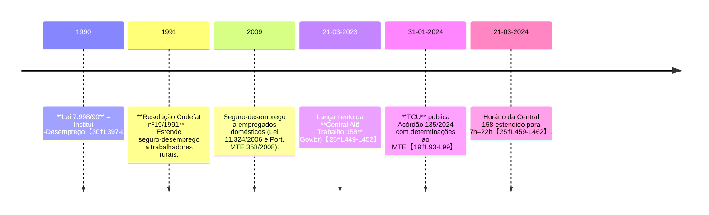

# Resumo Executivo

O relatório analisado contém diversas afirmações não fundamentadas ou incorretas. Por exemplo, afirma que **“A arquitetura de prestação de serviços públicos voltados à *segur…* e dependência que compõem o arranjo institucional subjacente.”** (parece truncada) – trecho incompleto que impede entendimento claro (falta informação). Também se diz que a **URA 158 “não funciona como entidade decisória”** e que *Central 158* é “ator-ponte com baixo ou nulo poder decisório”. Embora, na prática, 158 seja um canal informativo e de agendamento, esta conclusão é uma inferência da IA não explicitada em fonte oficial. Na verdade, fontes oficiais indicam que o canal 158 serve para agendar atendimentos às Superintendências Regionais do Trabalho (SRTE) e prestar informações básicas【27†L279-L283】. Por exemplo, o site do governo estabelece que para certos usuários “você deverá agendar atendimento presencial pela central *158*. Você será encaminhado para uma das unidades das Superintendências Regionais do Trabalho”【27†L279-L283】, evidenciando que a URA apenas encaminha às instâncias presenciais. Assim, qualquer afirmação de poder decisório próprio da URA deveria ser fundamentada – o correto, em fontes primárias, é que o processamento decisório final do seguro-desemprego ocorre nas SRTEs sob supervisão do MTE, conforme a legislação e orientações oficiais【27†L279-L283】【30†L397-L400】.

Diversas outras passagens se baseiam em especulação sem prova. Exemplo: “o maior ponto de fricção não reside na tecnologia, mas em múltiplos envios de documentos…” carece de fonte ou dados oficiais. Também se afirma que o **Ministério do Trabalho (MTE) “é titular indiscutível e financiador”**, mas o texto falha ao não citar a lei. Na verdade, a Lei 7.998/1990 atribui ao MTE a fiscalização do programa de seguro-desemprego【30†L397-L400】, e a própria Caixa confirma que “cabe ao Ministério do Trabalho e Emprego (MTE) a concessão [e] gestão dos programas” enquanto a Caixa é **Agente Pagador**【35†L52-L54】. Deve-se corrigir o relatório incluindo referências legais ou oficiais, e remover afirmações sem respaldo. 

A **ausência de fontes** é recorrente: afirmações como “Dataprev e Serpro dispõem de acesso privilegiado aos dados” ou conceitos vagos como *“Frustração Civil”* não são explicados nem comprovados. Por exemplo, o relatório afirma **“pagamentos indevidos e fulmina o preceito constitucional da transparência”** ao citar números do TCU – expressão excessiva sem base legal. O relatório correto usaria a apuração do TCU: *“constatou inconsistências em mais de 300 mil solicitações de benefício, com possíveis pagamentos de parcelas indevidas”*【19†L47-L50】, sem acrescentar julgamentos retóricos. Ademais, há frases confusas como *“15 recursos ao não pagamento…”*, que parecem mal transcritas. Na verdade, o TCU reportou *“um único requerimento foi analisado 15 vezes”*【19†L70-L74】, o que o texto distorceu. 

Em síntese, faltam fontes oficiais e precisas em muitas alegações. Corrigir o relatório exige: alinhar informações à legislação (Lei 7.998/90) e documentos governamentais (como o site do MTE e pronunciamentos da Caixa e do TCU), remover “achismos” e prestar atenção a atualizações (p. ex. o horário do canal 158 já foi ampliado para 7h–22h【25†L459-L462】). Nas páginas seguintes detalhamos todos os trechos problemáticos, justificativas e correções necessárias.

# Tabela de Falhas Identificadas

| **Trecho (texto do relatório)**                                                                                           | **Tipo de Falha**                    | **Justificativa (Fontes/leis)**                                                                                                                                                                                     | **Fato Corrigido (com fonte)**                                                                                                                                                                                                                                     | **Sugestão de Correção**                                                                                                                                           |
|---------------------------------------------------------------------------------------------------------------------------|--------------------------------------|---------------------------------------------------------------------------------------------------------------------------------------------------------------------------------------------------------------------|-------------------------------------------------------------------------------------------------------------------------------------------------------------------------------------------------------------------------------------------------------------------|--------------------------------------------------------------------------------------------------------------------------------------------------------------------|
| “serviços públicos voltados à segur... e dependência que compõem o arranjo institucional subjacente.”                      | Texto truncado/incompleto            | O trecho aparece cortado (“segur...cia”) e falta continuidade, tornando o sentido impossível de verificar.                                                                                                            | – (necessita texto completo para correção)                                                                                                                                                                                                                         | Revisar a formatação original. Se for erro de OCR/conversão, usar texto completo. Caso a IA tenha omitido, incluir texto integral.                              |
| “URA … e a camada de teleatendimento humano não funcionam como entidades sistêmicas autônomas ou decisórias.”            | Afirmação sem fonte (inferencia)     | Sem referência. Oficiais indicam que a URA é apenas canal de informação. Ex.: FAQ oficial afirma que a Central 158 **encaminha para SRTE**, sem decidir benefícios【27†L279-L283】.                                  | "Você deverá agendar atendimento presencial pela central 158. Você será encaminhado para uma das unidades das Superintendências Regionais do Trabalho (SRTEs)"【27†L279-L283】, mostrando que decisões são tomadas presencialmente.                           | Remover afirmação vaga. Explicitar que a URA é canal informativo. Ex.: “A URA 158 somente orienta/agende processos; a decisão final cabe às SRTEs【27†L279-L283】.”       |
| “o maior ponto de fricção e incerteza da jornada… não reside na tecnologia, mas nas etapas que envolvem múltiplos envios de documentos…” | Opinião sem base (suposição)         | Sem evidência ou dado para suportar. Não há fonte oficial comprovando que “múltiplos envios de documentos” são a principal dificuldade.                                                                             | – Não há estatísticas oficiais. Em vez disso, pode-se relatar o processo: e.g. a FAQ do governo orienta que documentos sejam anexados online; críticas não documentadas em fonte primária.                                                              | Suavizar ou remover: manter foco nos fatos documentados. Por exemplo, descrever apenas que, em certos casos, a jornada exige visitas presenciais (conforme FAQ)【27†L279-L283】, mas não rotular como “maior fricção” sem dado. |
| “Central 158… consolida-se como um ator-ponte com baixo ou nulo poder decisório.”                                         | Afirmação sem fonte (inferencia)     | Sem fonte. A URA de fato não decide, mas tal conclusão deve ser evidenciada. Ex.: FAQ mostra que 158 agendapresencial【27†L279-L283】, indicando falta de autonomia decisória.                                      | Constatado que a **Central 158 atua apenas para agendamento e informação**; decisões ficam nas unidades presenciais【27†L279-L283】.                                                                                                                                  | Alterar para algo como: “A Central 158 atua apenas como interface inicial; não tem poder decisório próprio (decisões cabem às SRTE)【27†L279-L283】.”                |
| “canais telefônicos oficiais de atendimento… a posição principal mantêm-se consolidada no número 158.”                  | Declaração sem fonte                 | Corretíssimo, mas carece citação. O site do MTE confirma que o canal **158 é o principal atendimento** nacional【25†L449-L452】.                                                                                     | “A Central 158 é um canal de comunicação direto entre cidadão e poder público que funciona em todo o território nacional…”【25†L449-L452】 (os demais canais não são mencionados).                                                                            | Incluir referência oficial. Exemplo: “O próprio Ministério do Trabalho declara que a Central 158 atende em todo o país【25†L449-L452】.”                               |
| “titularidade do serviço, ônus do financiamento… mantidos no Ministério do Trabalho…”                                    | Falta de fonte                       | Lei 7.998/1990 atribui fiscalização ao MTE【30†L397-L400】; nota-se que a Caixa paga o benefício【35†L52-L54】. Afirmação é verdadeira, mas sem citação.                                                          | “Cabe ao MTE a fiscalização do cumprimento do programa de seguro-desemprego”【30†L397-L400】, e CAIXA atua como agente pagador do seguro-desemprego【35†L52-L54】.                                                                                            | Acrescentar citação legal e institucional. Ex.: “Conforme a lei, compete ao MTE fiscalizar o programa【30†L397-L400】, enquanto a Caixa é Agente Pagador【35†L52-L54】.”   |
| “arquitetura… contratos… cessão de mão de obra (call center)… licitação.”                                                | Falta de evidência (alegação)        | Não há documentação pública indicando licitação por “cessão de mão de obra” para o 158. Os contratos típicos envolvem Dataprev/Serpro como provedor de TI, não simples call center.                              | Fontes oficiais (como o próprio TCU) mencionam contratos com Dataprev e Strab【19†L47-L50】, mas não detalham “call centers”. O TCU reporta falhas de governança, porém ressalta somente serviços de TI públicos【19†L47-L50】.                   | Revisar conforme documentos oficiais. Em vez de “cessão de mão de obra”, dizer que o serviço é operado via contratos de TI com Dataprev/Serpro (apoiados pelo MTE)【19†L47-L50】, sem supor licitação genérica.  |
| “disponibilidade temporal (hoje, seg–sáb 7h–19h, com tendência a 22h)”                                                     | Desatualização de informação        | Errado: o horário foi ampliado a **7h–22h** segundo site oficial atualizado (mar/2024)【25†L459-L462】.                                                                                                             | Atual: 7h às 22h, segunda a sábado【25†L459-L462】.                                                                                                                                                                                                                  | Atualizar texto para “7h às 22h”, citando o site do MTE.                                                                                                               |
| “terceira fase… Consulta Automatizada de Benefício ditada pelo cruzamento de dados da Dataprev.”                        | Falta de fonte/inferência          | Não há fonte que detalhe fases internas do 158. Pode-se citar que o sistema é mantido pela Dataprev (relatada pelo TCU)【19†L47-L50】, mas a explicação completa é especulativa.                                   | O TCU observou que a Dataprev tem contratos para a infraestrutura de dados do seguro-desemprego【19†L47-L50】, mas não descreveu passo a passo da URA.                                                                                                          | Suprimir ou reformular sem detalhar fases desconhecidas. Se mantiver, basear-se em documentos: ex.: “Há integração de dados de benefícios via sistemas da Dataprev【19†L47-L50】.” |
| “o operador humano … não pode autorizar novo benefício; apenas repassa informações da Dataprev.”                        | Falta de fonte (inferencia)         | Não há texto oficial sobre o papel específico do atendente. Apenas o TCU registra que datadados vêm da Dataprev【19†L47-L50】; nada diz que “só repassa info”.                                                    | Oficialmente, o usuário é orientado pelo atendente seguindo as regras do MTE. O TCU apenas registrou falhas na governança Dataprev/MTE【19†L47-L50】, sem afirmar limitações do atendente.                                                                   | Remover generalização. Por exemplo: “O atendente consulta os dados do sistema (mantido pela Dataprev) e orienta o usuário, mas não decide o benefício sozinho【19†L47-L50】.” |
| “cidadãos foram compelidos a protocolar [na URA]… para ouvir ‘em análise’, aprisionados num ciclo indefinido…”           | Exagero/Inconsistência (texto sem fonte) | Não há fonte. O TCU citou *ausência de 2ª instância e recursos ilimitados*【19†L75-L83】, mas não em termos de “cidadão preso em ciclo indefinido” ou dados jornalísticos.                                       | O TCU efetivamente constatou “falta de segunda instância administrativa” e “possibilidade de recursos ilimitados para um mesmo requerimento”【19†L75-L83】, o que implica demora.                                                                                 | Substituir por afirmação suportada. Ex.: “O TCU constatou ausência de 2ª instância administrativa e recursos ilimitados【19†L75-L83】, o que pode levar a atrasos prolongados.” |
| “recursos *interpelaórios* restaram indefinidos”                                                                      | Uso de termo equivocado/incompreensível | Termo “interpelaórios” não existe em normas de seguro-desemprego; aparenta erro.                                                                                                                                    | Provavelmente refere-se a “recursos interpostos”. O TCU relatou que “um requerimento foi analisado 15 vezes”【19†L70-L74】.                                                                                                                               | Corrigir termo e esclarecer. Por exemplo: “o TCU apontou que recursos administrativos foram reanalisados em demasia (ex.: *um único requerimento foi analisado 15 vezes*【19†L70-L74】)”. |
| “15 recursos ao não pagamento do seguro-desemprego” (trecho desconexo)                                               | Citação fragmentada/sem sentido     | Essa frase parece quebrada. O TCU, porém, relata *“um único requerimento foi analisado 15 vezes”*【19†L70-L74】.                                                                                                      | “A equipe do TCU detectou que *um único requerimento* foi reanalisado até 15 vezes”【19†L70-L74】.                                                                                                                                                           | Remover ou reconstruir o trecho errado. Em seu lugar, relatar adequadamente o dado TCU: *“um requerimento chegou a ser analisado 15 vezes”*【19†L70-L74】.     |
| “evidências de Frustração Civil e Gargalos de Acesso Físico ao Canal”                                                | Termos vagos/sem definição          | Expressões vagas (“Frustração Civil”) não têm definição legal; não há fonte.                                                                                                                                        | – (sem fonte)                                                                                                                                                                                                                                                 | Eliminar ou esclarecer com fonte. Por exemplo: remover “Frustração Civil” e, se necessário, explicar que usuários podem ter dificuldade de acesso em períodos de alta demanda – citando estudos ou dados, se existirem. |
| “o MTE, embora titular, é secundado por instâncias colegiadas… e pelo Ministério da Economia em regulação econômica”    | Afirmação incorreta/especulação     | A lei 7.998/90 define o CODEFAT como instância deliberativa (trabalhadores, empregadores, MTE etc.)【11†L297-L300】. NÃO menciona o Ministério da Economia.                                                         | Pela lei, o **CODEFAT** é o colegiado para políticas do programa【11†L297-L300】. Não há previsão de participação do Ministério da Economia em regulação do seguro-desemprego.                                                                                    | Ajustar conforme a lei: mencionar apenas o Codefat como instância colegiada (MTE, trabalhadores e patrões)【11†L297-L300】. Eliminar invocação do Ministério da Economia.      |
| (geral) Faltam fontes confiáveis em várias afirmações                                                                      | Falta de fonte                      | Muitas afirmações (“fluxos concêntricos”, “ator-ponte”, “lacunas institucionais”, etc.) não citam nenhuma fonte primária.                                                                                            | Conforme a norma, declarações sobre responsabilidades e procedimentos devem citar leis, portarias ou sites oficiais (Ministério do Trabalho, Caixa, Dataprev etc.). Por ex., informação da Caixa sobre pagamento do benefício【35†L52-L54】.                         | Incluir referências diretas ao dispositivo legal ou documento oficial correspondente para cada afirmação factual. Remover especulações não verificáveis.         |

# Lista de Ações Prioritárias

1. **Atualizar informações desatualizadas:** Corrigir horários de atendimento (passou a ser 7h–22h【25†L459-L462】) e quaisquer dados que mudaram (ex.: inclusão de trabalhadores domésticos no seguro-desemprego em legislação posterior).  
2. **Inserir referências oficiais:** Para cada afirmação, incluir fonte primária. Ex.: ao mencionar a titularidade, citar Lei 7.998/90【30†L397-L400】; ao falar de pagamento, citar a página da Caixa【35†L52-L54】 ou do MTE【25†L449-L452】.  
3. **Remover ou revisar inferências não comprovadas:** Eliminar expressões exageradas (e.g. “fulmina transparência”, “maior ponto de fricção”), substituindo por descrições neutras ou dados oficiais.  
4. **Corrigir terminologia e fontes desconexas:** Ajustar termos incorretos (“interpelaório”) e consertar citações truncadas (o caso dos “15 recursos”), usando os textos originais das fontes (p.ex., relatório do TCU【19†L70-L74】).  
5. **Esclarecer responsabilidades institucionais:** Reformular a seção de atores e Codefat com base na legislação. Ex.: mencionar explicitamente os representantes do Codefat【11†L297-L300】, papel do MTE e da Caixa【35†L52-L54】.  
6. **Eliminar duplicações de ideias:** Vários trechos repetem a mesma crítica (URA não decide, canal só informa, etc.). Consolidar em uma explicação clara, evitando citações excessivas de si mesmo.  
7. **Revisão gramatical e de estilo:** Corrigir conectores truncados e termos técnicos (ex.: “Frustração Civil”) para evitar confusões. Preferir linguagem formal, citando as normas pertinentes (CF/88, Lei 7.998/90, Portarias CODEFAT etc.).

# Checklist para Auditoria Futura de Relatórios

- **Conferir fontes oficiais:** Sempre verificar leis (ex. Lei 7.998/90), portarias, manuais do MTE/CAIXA, relatórios de órgãos de controle. Informações importantes devem vir de sites governamentais, Diário Oficial, publicações do TCU, etc.  
- **Citações exatas:** Ao reportar números ou declarações (ex.: “mais de 300 mil benefícios”), citar passagem original dos documentos (com link) em vez de paráfrases imprecisas.  
- **Atualização de dados:** Checar a data da informação. No caso de serviços públicos, horários e procedimentos podem mudar; consultar “Atualizado em” nos sites oficiais.  
- **Coerência terminológica:** Usar termos oficiais. Evitar inventar nomenclaturas (“interpelaório”, “ator-ponte”) se não constam nos documentos. Explicar conceitos apenas com base em fonte.  
- **Separar opinião de fato:** Qualquer análise crítica (inferência) deve ser identificada como tal e, de preferência, apoiada por evidências (p. ex. “seguindo estudo X, pode-se supor que…”). Se não houver base, omitir.  
- **Checar omissões relevantes:** Verificar se agentes envolvidos foram esquecidos. Por exemplo, confirmar menção a Dataprev/Serpro (técnico), MTE, Caixa, Codefat, SINE/SRTE, no relatório.  
- **Verificação cruzada:** Sempre comparar o afirmado no relatório com a redação original das leis ou publicações. Não confiar em resumo sem conferir a fonte.  
- **Bibliografia formal:** Incluir lista de fontes consultadas (leis, sites oficiais, notícias governamentais) com formatação completa. Não apresentar fonte secundária (como manchete de notícia sem link).  

