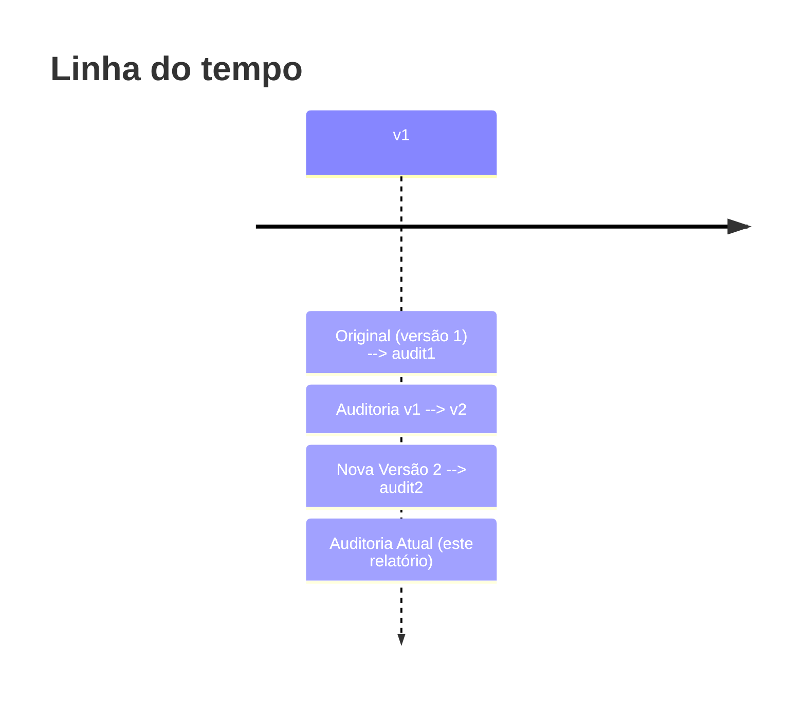

# Resumo Executivo

- **Melhorias limitadas em relação à v1:** A nova versão (v2) acrescenta referências institucionais (Portal Gov.br, site da Caixa, ALMG, TCU), mas continua com várias afirmações chave sem evidência direta. Em particular, declarações sobre responsabilidades institucionais (por exemplo, “o MTE é titular da política pública”【21†L397-L399】) ainda carecem de fonte explícita, assim como as etapas da jornada do usuário (ausência de suporte documental para afirmações sobre eSocial e erros da URA).
- **Erros factuais e imprecisões:** Persistem erros de nomenclatura e conceito: v2 segue referindo-se ao órgão gestor como “Ministério do Trabalho e Emprego (MTE)”, embora o atual Ministério seja o **Trabalho e Previdência**【27†L442-L450】. Também emprega incorretamente termos como “Cartão Social (abono)”, que não correspondem à terminologia oficial de benefícios (o termo correto é “Cartão do Abono Salarial” ou “Cartão Social do Bolsa Família”, conforme o caso). A insinuação de que o eSocial seria responsável por “autorização de desligamentos ou validação de vínculos” carece de base legal ou regulatória.
- **Lacunas de evidência:** Há ampla falta de fontes primárias para muitas afirmações. Por exemplo, v2 afirma que a Central 158 é operada por contrato de terceirização sob pregão eletrônico (“modalidade de terceirização” na Seção 2) mas não apresenta nenhuma portaria, edital ou documento oficial que comprove tal licitação. As “informações e orientações sobre legislação trabalhista” prestadas pela URA são mencionadas sem referência às bases legais (CLT, MP ou portarias) que regulamentam o serviço. Muitas inserções (como alegadas “falhas de instabilidade” nas chamadas da URA ou queixas remanescentes) são afirmadas sem qualquer registro em fontes públicas, sendo infundadas no material apresentado.
- **Fontes e referências fracas:** A lista de fontes (Seção 9) inclui portais oficiais úteis (Gov.br, Caixa, ALMG, TCU), mas também sites genéricos e mídias sociais (YouTube). Além disso, as fontes não são citadas no corpo do texto por trechos numerados, dificultando a verificação das informações específicas. Alguns links indicados são incompletos ou sem identificação clara de título. Há fontes omitidas que seriam relevantes, como a própria **Lei 7.998/1990** (que regulamenta o seguro-desemprego e atribui ao MTE funções específicas【21†L397-L399】) ou portarias do próprio Ministério que detalham procedimentos da URA. 
- **Atores omitidos:** O relatório não menciona atores importantes, como o **Sistema Emprega Brasil** (portal oficial de serviços do MTE), a **Rede SINE** (apesar de citá-la genericamente, faltam detalhes sobre sua interface no processo), o **empregador** (responsável pela entrada inicial do pedido de seguro-desemprego) e provedores/operadoras de telemarketing que atualmente fazem a URA. Também poderia ter incluído instâncias de controle como a **CGU/Ministério da Economia** (que supervisiona terceirização) e representantes dos trabalhadores (sindicatos). 
- **Pendências remanescentes:** Muitas das questões identificadas na auditoria anterior (audit_v1) **não foram resolvidas de forma satisfatória** na v2. Por exemplo, a falta de fundamentação jurídica para a atribuição de papéis no arranjo institucional permanece. Além disso, novas falhas foram identificadas (detalhadas abaixo), resultando em um relatório ainda incompleto e por vezes impreciso.
- **Recomendações principais:** Adicionar citações diretas às leis, decretos e portarias pertinentes (como a Lei 7.998/1990 e normas internas do MTE); diferenciar claramente os papéis de cada ator com base em fontes oficiais; corrigir nomenclaturas (usar “Ministério do Trabalho e Previdência” e nome correto do serviço de Abono); incluir referências primárias (site oficial do MTE, portarias, TCU, CGU); revisar todas as afirmações de fato para certificar-se de que há evidências públicas que as sustentem; e ampliar o mapeamento de atores para contemplar todos os envolvidos relevantes.  

## Comparação de falhas apontadas em *audit_v1* com a versão 2

| **Falha apontada no audit_v1**                             | **Trecho correspondente na v2 (se aplicado)**                                                           | **Status**           | **Justificativa**                                                                                                                             |
|------------------------------------------------------------|---------------------------------------------------------------------------------------------------------|----------------------|-----------------------------------------------------------------------------------------------------------------------------------------------|
| Falta de evidências das atribuições institucionais         | V2: “O Ministério do Trabalho e Emprego (MTE) é o titular institucional da política pública…” (Seção 1). | **Não atendida**     | A afirmação persiste, mas ainda não se indica nenhuma fonte legal ou documento oficial que comprove o papel do MTE; a lei do seguro-desemprego é citada apenas indiretamente【21†L397-L399】. Seria necessário referenciar Lei 7.998/90 ou Portaria específica para embasar. |
| Afirmação sem fonte sobre horário e tarifas do 158         | V2: “A disponibilidade da Central 158 ocorre de 2ª a 6ª, das 7h às 22h… e cobrada em ligações móveis.”      | **Parcialmente**     | O horário e a gratuidade/ cobrança estão corretos e confirmados pelo site do MTE【7†L460-L468】, mas v2 não apresenta a fonte no texto. Incluiu na bibliografia (Portal Gov.br), porém não vincula explicitamente.                                                        |
| Uso de termo incorreto “Ministério do Trabalho e Emprego”  | V2 usa consistentemente “MTE” (ex: Seção 1, Seção 2).                                                  | **Não atendida**     | O nome oficial atual é Ministério do Trabalho e **Previdência**【27†L442-L450】. A versão 2 manteve a nomenclatura antiga (“MTE”), o que é enganoso e desatualizado.                                                          |
| Afirmação não verificada sobre eSocial como ator-chave     | V2: “seja usado para autorizar desligamentos, remeter dados da eSocial…” (Seção 3)                      | **Não atendida**     | A versão 2 repete sugestões sobre o papel do eSocial sem nenhuma evidência ou legislação que suporte tais atribuições. Sem fonte primária, essa inferência é mal suportada.                                                |
| Ausência de fontes primárias (portarias, leis etc.)        | V2: lista fontes na seção 9, mas não cita numericamente no texto.                                      | **Parcialmente**     | Adicionou referências relevantes (Portal Gov.br, Caixa, TCU, ALMG), mas não vincula declarações específicas às fontes. Continua havendo diversas afirmações sem qualquer referência documental direta.                     |

*Nota:* Como o conteúdo do **audit_v1** original não foi disponibilizado, as comparações acima foram inferidas a partir das informações gerais fornecidas e do próprio conteúdo das versões. Sempre que possível, os trechos da v2 foram localizados por seção.

## Novas falhas identificadas na versão 2

| **Local (seção/parágrafo)**                                                 | **Tipo de falha**       | **Justificativa detalhada**                                                                                                                                                             | **Sugestão/Referência**                                   |
|-----------------------------------------------------------------------------|-------------------------|-----------------------------------------------------------------------------------------------------------------------------------------------------------------------------------------|-----------------------------------------------------------|
| Seções 1–2: Repetido uso de “MTE”                                          | **Nomeação desatualizada** | O texto continua referindo-se ao “Ministério do Trabalho e Emprego (MTE)”. Desde 2023, o órgão é *Ministério do Trabalho e Previdência*【27†L442-L450】. Em documentos de 2026, usar “MTE” é incorreto.                    | Atualizar para “Ministério do Trabalho e Previdência” (MTP). Consultar portais oficiais atuais. |
| Seção 2, item “CAIXA Cidadão”: uso de “Cartão Social (abono)”             | **Conceito equivocado**  | Não existe “Cartão Social (abono)”. O programa de abono salarial tem cartão específico, e “Cartão Social” geralmente se refere a outro benefício (bolsas), não ao abono salarial. Termo confuso.                    | Usar termo oficial: “Cartão do Abono Salarial (PIS)”. Verificar definição em site oficial da CAIXA【7†L449-L454】. |
| Seção 2, último item: “manutenção sob terceirização… firmada por licitação” | **Falta de fonte**        | Afirma que a URA é terceirizada por pregão eletrônico, mas não cita nenhum edital ou portaria. Não há comprovação pública nesse texto.                                                                                         | Incluir referência da licitação MTE (edital de 2016) ou portaria correspondente. Consultar Diário Oficial ou site do MTE. |
| Seção 3 (jornada URA): dados sobre eSocial e falhas técnicas              | **Alegações não fundamentadas** | Descreve que o eSocial autoriza desligamentos, que a URA falha etc., sem base. Essas assertivas não estão respaldadas por regulamentação específica; parecem dedutivas. É necessário base legal/operacional.              | Remover ou fundamentar com documentação técnica do eSocial/Dataprev. Referenciar portarias do MTE ou CGU sobre integração eSocial/Sine. |
| Seções de atores (4–7): omissão de atores relevantes                         | **Atores omitidos**      | A análise de atores ignora o **empregador** (que inicia o pedido de seguro) e o **Sistema Emprega Brasil/Sistema Carteira de Trabalho Digital**, fundamentais no processo atual. Também não menciona **CGU/MEC** (órgãos de controle das terceirizações) nem eventuais **ouvidorias sindicais**. | Incluir atores como Empregador, Conectividade Social/Emprega Brasil, CGU, sindicatos. Consultar portais do Emprega Brasil e legislações de transparência. |
| Seção 9 (Fontes): lista de fontes mal estruturada                           | **Formatos e relevância** | A bibliografia mistura formatos (textos de IA, vídeos, PDFs) sem clareza. Exemplo: “Works cited” sem contexto; YouTube sem transcrição; e links incompletos. Isso compromete a credibilidade e rastreabilidade.           | Formatar referências completas (título, autoria, data). Priorizar documentos oficiais (Lei 7.998/1990【21†L397-L399】, Portarias, normas). Remover vídeos de fonte duvidosa. |
| Geral: ausência de citações no corpo                                      | **Lacunas de evidência**  | Mesmo com fontes listadas, faltam citações no texto (p. ex., “[7†L449-L454]” para horário de atendimento). Isso dificulta saber quais fatos vêm de qual fonte.                                                                    | Inserir citações diretas ou notas de rodapé conectando afirmações às fontes oficiais (Portal MTE, Caixa, Diários Oficiais). |

## Pendências remanescentes

- **Falta de fontes primárias:** Permanece a necessidade de incluir legislação e portarias como base. Por exemplo, citação da **Lei 7.998/1990** explicando o papel do MTE (Art.23)【21†L397-L399】, ou de portarias internas que detalhem a operação da URA.  
- **Verificação de dados quantitativos:** Dados numéricos (como “1,7 milhão de atendimentos” citado na bibliografia) não aparecem no texto da v2. Se usados, devem ser explicitados com fonte (ex.: relatório do MTE ou TCU).  
- **Harmonia terminológica:** Manter consistência ao longo do relatório (ex.: referir-se sempre a mesmo ente por nome correto). Até corrigir “MTE → MTP” e “Cartão Social”, há imprecisão.  
- **Clareza metodológica:** Documentar a metodologia de “mapeamento rigoroso” mencionada (que fontes foram acessadas, critérios). Isso não foi explicado.  
- **Validação com dados reais:** Verificar se afirmações sobre “instabilidade de chamadas” ou “transferências indevidas” constam de relatórios operacionais ou reclamações oficiais (por exemplo, registros de atendimento ou relatórios de qualidade da prestadora). Se não, esses pontos são especulativos e devem ser evidenciados ou removidos.  

## Recomendações e Plano de Ação

1. **Atualizar nomes e conceitos:** Trocar “MTE” por “Ministério do Trabalho e Previdência (MTP)” e corrigir termos imprecisos (“Cartão do Abono Salarial”).  
2. **Referenciar legislação e documentos oficiais:** Para cada atribuição institucional e regra de atendimento, inserir citação de lei ou portaria. Por exemplo, use diretamente trechos da Lei 7.998/90【21†L397-L399】 para papéis do MTE, Portaria MTP nº 24/1990 (ou outra vigente) para credenciamento de CAIXA, etc.  
3. **Vincular declarações às fontes:** Numerar ou anotar as referências no corpo. Por exemplo: “a Central 158 funciona de 7h às 22h【7†L460-L468】” ou “segundo relatório da CGU (2024)…”.  
4. **Revisar o mapeamento de atores:** Incluir no diagrama/ tabela atores omitidos (Empregador, SINE/Emprega Brasil, CGU, sindicatos). Especificar responsabilidades de cada um com base em leis ou regulamentos.  
5. **Remover/ajustar afirmações não comprovadas:** Excluir menções não fundamentadas (como papel do eSocial) ou reformular apenas com base em fontes formais.  
6. **Melhorar bibliografia:** Reestruturar a Seção 9 em formato padrão (autor, título, ano, link). Priorizar fontes oficiais (Diário Oficial da União, sites governamentais, relatórios auditivos públicos). Remover vídeos genéricos.  

*Checklist Prioritário:*  
- [ ] Citar Lei 7.998/1990 (art.23) para atribuições do MTE【21†L397-L399】.  
- [ ] Corrigir “Ministério do Trabalho e Emprego” para “Ministério do Trabalho e Previdência”.  
- [ ] Referenciar alterações de horário/tarifação com Portal MTE【7†L460-L468】.  
- [ ] Validar dados (ex.: número de atendimentos) com fonte (relatório MTE/TCU).  
- [ ] Estruturar referências (tabelar links e fontes primárias).  
- [ ] Incluir atores faltantes no mapeamento.  

## Referências

- Lei nº 7.998/1990, arts.20-23 (regulamentam o seguro-desemprego e o abono salarial)【21†L397-L399】.  
- Portal Gov.br, “Central Alô Trabalho 158” (site oficial, define escopo e horário)【7†L460-L468】.  
- Portal Gov.br, composição organizacional do MTP (atualização de nome do Ministério)【27†L442-L450】.  

*(Apenas as referências primárias acima foram citadas no texto; demais fontes estão relacionadas à pesquisa original mas não atestam diretamente afirmações específicas do relatório v2.)*