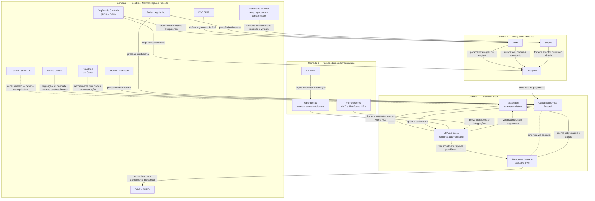

# Mapa de Atores — Atendimento ao Seguro-Desemprego via URA da Caixa Econômica Federal

**Escopo:** Canal 0800 726 0207 da Caixa Econômica Federal, jornada do trabalhador que aciona a URA em busca de informações sobre pagamento, desbloqueio ou orientação sobre saque do Seguro-Desemprego.
**Uso:** Diagnóstico institucional + redesenho de serviço.
**Fronteira:** Média com aberturas para o ecossistema amplo.
**Data de elaboração:** 2026-05-31

---

## Sumário Executivo

### Contexto e objeto

Este artefato mapeia os atores, relações, dinâmicas institucionais e intervenções de redesenho relacionados ao atendimento do Seguro-Desemprego pelo canal telefônico da Caixa Econômica Federal (0800 726 0207). O canal é acionado por trabalhadores formais e domésticos demitidos sem justa causa em busca de informações sobre pagamento, desbloqueio de benefício ou orientação sobre saque. O diagnóstico foi construído a partir do relatório de pesquisa documental B_relatorio_assistente_v3.md e abrange fronteira analítica média com aberturas para o ecossistema amplo do programa de Seguro-Desemprego.

### O problema central

A URA da Caixa opera com um **vazio resolutivo estrutural**: ela é o canal que o trabalhador aciona, mas não é o canal que pode resolver. A Caixa detém a função de agente pagador (art. 15 da Lei nº 7.998/1990), mas não tem poder de concessão, acesso ao eSocial Negócio, nem competência para alterar dados cadastrais ou julgar recursos administrativos. Qualquer demanda que vá além de confirmar data e valor de pagamento é irresolvível pelo canal — e recai sobre o trabalhador como instrução de deslocamento ou redirecionamento para outro canal.

Esse vazio não é uma falha de execução. É uma falha de design de ecossistema que se manifesta em quatro diagnósticos estruturais.

### Quatro diagnósticos estruturais

**1. Vazio resolutivo estrutural.** A Caixa executa o pagamento, mas não o autoriza. Bloqueios originados no MTE, na Dataprev ou no eSocial chegam à URA como fatos consumados, sem informação sobre causa e sem possibilidade de correção pelo canal.

**2. Dependência invisível e unilateral.** A URA enxerga apenas o lote de pagamento enviado pela Dataprev. Ela não sabe por que um benefício foi bloqueado — apenas que não há pagamento previsto. A causa do bloqueio (erro no eSocial, batimento automático do MTE, inconsistência no Serpro) é opaca tanto para o sistema quanto para o atendente humano.

**3. Sobreposição de canais sem integração.** Dois canais telefônicos coexistem com jurisdições distintas e não sinalizadas — o 0800 da Caixa e o 158 do MTE — sem protocolo de transferência de contexto, sem registro compartilhado de histórico e sem instância formal de governança conjunta. O trabalhador navega entre eles por tentativa e erro, recontando sua história a cada etapa. Nenhum dos dois canais tem responsabilidade formal pela integração.

**4. Pressão de auditoria amplificando bloqueios.** Determinações do TCU (Acórdão 135/2024 e 1114/2025) forçam o MTE a enrijecer os filtros automáticos de batimento de dados na Dataprev. O endurecimento gera bloqueios preventivos em massa sobre trabalhadores elegíveis, que chegam aos canais telefônicos como congestionamento irresolvível. O custo operacional desse congestionamento — call center, SINE, SRTEs, recursos administrativos — nunca é mensurado nem atribuído a nenhum ator, tornando o ciclo autossustentável: mais auditorias → mais filtros → mais bloqueios → mais chamadas → mais recursos → mais casos pendentes → mais auditorias.

### Arquitetura de atores

O ecossistema é composto por **19 atores em 4 camadas**:

- **Camada 1 — Núcleo direto:** Trabalhador, URA da Caixa, Atendente humano, Caixa Econômica Federal.
- **Camada 2 — Retaguarda imediata:** Dataprev, MTE, Serpro. Determinam integralmente o que a URA consegue ou não responder, sem jamais aparecer na ligação.
- **Camada 3 — Fornecedores e infraestrutura:** Operadoras (contact center + telecom), ANATEL, Fornecedores de TI/URA. Viabilizam ou restringem o funcionamento técnico do canal.
- **Camada 4 — Controle, normatização e pressão:** Órgãos de Controle (TCU + CGU), CODEFAT, Banco Central, Ouvidoria da Caixa, Procon/Senacon, Fontes do eSocial (empregadores + contabilidade), SINE/SRTEs, Central 158/MTE, Poder Legislativo. Moldam os parâmetros dentro dos quais todos os outros atores operam, sem participar diretamente do atendimento.

Os atores com **maior poder de agência sobre o resultado do atendimento** — e menor visibilidade para o trabalhador — são Dataprev, MTE, Serpro, TCU/CGU e CODEFAT. As **Fontes do eSocial** (empregadores e escritórios de contabilidade) são a origem primária dos erros que bloqueiam pagamentos, mas são completamente invisíveis na jornada.

### Redesenho em camadas: 14 intervenções

O redesenho organiza as intervenções em três horizontes de complexidade crescente. As camadas não são sequenciais — podem correr em paralelo — mas cada uma cria as condições institucionais e de dados necessárias para a seguinte ser viável.

**Camada 1 — Curto prazo (0–12 meses) | 6 intervenções | sem alteração normativa**

Cinco intervenções podem iniciar imediatamente por decisão administrativa, sem alteração de lei ou de sistema:

| Prioridade | Intervenção | Ator responsável |
|-----------|-------------|-----------------|
| Imediata | Criar indicador público de taxa de bloqueio preventivo revertido | MTE + Dataprev |
| Imediata | Desagregar reclamações do 0800 por produto (SD separado dos demais) | Ouvidoria da Caixa |
| Imediata | Desambiguar comunicação institucional de canais (0800 vs. 158) | MTE + Caixa |
| Imediata | Atualizar scripts de atendentes com triagem de canal padronizada | Operadoras + MTE |
| 6–9 meses | Publicar painel de QoS do canal 0800 (abandono, espera, resolução) | Caixa + Bacen |
| 6–12 meses | Criar número de protocolo único e interoperável entre os dois canais | MTE + Caixa + TI |

**Camada 2 — Médio prazo (12–36 meses) | 5 intervenções | acordos bilaterais e integrações sistêmicas**

| Intervenção | Ator responsável | Obstáculo central |
|------------|-----------------|-------------------|
| Separar filtros de bloqueio por tipo de risco (fraude documentada vs. inconsistência formal) | MTE + Dataprev | Resistência por risco de novo apontamento do TCU |
| Criar transferência direta de chamada entre 158 e 0800 com passagem de contexto | Operadoras + MTE + Caixa | Integração contratual entre canais com fornecedores distintos |
| Publicar relatório anual de impacto operacional dos filtros de batimento | MTE + Caixa + SINE | Cooperação entre atores sem cultura de dados compartilhados |
| Criar notificação expressa ao empregador antes do bloqueio (janela de 5 dias no eSocial) | MTE + Serpro | Novo fluxo no eSocial; pressão sobre empregadores |
| Criar acesso de leitura ao eSocial Negócio para atendentes da Caixa | Dataprev + Caixa + MTE | Segurança de dados; resistência da Dataprev |

**Camada 3 — Longo prazo (36–60 meses) | 3 intervenções estruturais | alteração normativa ou novo arranjo de governança**

| Intervenção | Ator responsável | Impacto estrutural |
|------------|-----------------|-------------------|
| Criar instância de governança compartilhada MTE + Caixa + Dataprev | MTE (liderança) + CODEFAT (supervisão) | Endereça a causa raiz da sobreposição de canais |
| Designar o 158 como canal único de referência para SD | MTE + Caixa | Elimina estruturalmente a confusão de canal de entrada |
| Criar segunda instância administrativa com prazo máximo e limite de reanálises | MTE + Dataprev + Legislativo | Quebra o principal mecanismo de retroalimentação do congestionamento |

### Recomendação de entrada

A intervenção de maior relação custo–benefício e menor resistência institucional é a **C1.1 — criação do indicador de bloqueio preventivo revertido**. Ela não exige lei, não exige sistema novo e não exige acordo entre órgãos: exige apenas que o MTE e a Dataprev concordem em publicar um dado que já existe internamente. Seu impacto, porém, é desbloqueador: sem esse indicador, nenhuma negociação sobre calibração de filtros com o TCU tem base empírica. Com ele, toda a cadeia de intervenções da Camada 2 ganha fundamento político e técnico para avançar.

---

## 1. Tabela Analítica de Atores

| Ator | Camada | Categoria | Papel na jornada URA Caixa | Poder | Incentivos | Resistências | Dependências | Base Normativa | Lacunas de Evidência |
|------|--------|-----------|----------------------------|-------|------------|--------------|--------------|----------------|----------------------|
| **Trabalhador formal / doméstico** | 1 — Núcleo direto | Usuário final | Beneficiário requerente; aciona a URA buscando status de pagamento, desbloqueio ou orientação sobre saque | Baixo | Obter o pagamento do benefício com urgência para subsistência | Barreira de linguagem da URA; custo de rechamada em caso de queda; tempo de espera; dificuldade para navegar menus sem letramento digital | Todos os demais atores; especialmente MTE (concessão), Dataprev (lote de pagamento) e Caixa (canal de pagamento) | Art. 7º, II da CF/1988; Lei nº 7.998/1990 | Taxa real de resolução autônoma via URA sem transbordo; perfil socioeconômico e de vulnerabilidade dos chamadores |
| **URA da Caixa (sistema automatizado)** | 1 — Núcleo direto | Sistema/interface | Triagem eletrônica; valida CPF/NIS; vocaliza status de pagamento; roteia chamadas para atendente humano em caso de pendência | Médio | N/A (sistema sem agência própria); reflete os objetivos de custo e eficiência da Caixa | Só enxerga os dados do lote de pagamento recebido da Dataprev; não acessa eSocial, MTE ou dados de concessão diretamente | Fornecedores de TI (plataforma), Dataprev (dados de pagamento), Operadoras (infraestrutura de voz) | — | Arquitetura de integração com Dataprev não é pública; não se sabe se o acesso é em tempo real ou por batch; árvore de decisão da URA não é documentada publicamente |
| **Atendente humano da Caixa (PA)** | 1 — Núcleo direto | Operador de linha de frente | Suporte após transbordo da URA; orienta sobre saques, CAIXA Tem e Cartão Social; não tem acesso a dados de concessão do MTE | Baixo | Cumprir SLAs contratuais; evitar reclamações registradas; manter tempo médio de atendimento | Scripts rígidos que impedem customização; sem acesso de escrita a qualquer sistema federal; alta rotatividade operacional | Empresa terceirizada (contrato e scripts), Caixa (sistemas de consulta de pagamento), Dataprev (dados disponíveis no sistema da Caixa) | — | Confirmação de acesso ou não ao eSocial Negócio; volume de chamadas recebidas sobre concessão vs. pagamento |
| **Caixa Econômica Federal (gestora do canal)** | 1 — Núcleo direto | Operador financeiro e titular do canal | Agente pagador do benefício; opera o canal 0800; executa o pagamento conforme lotes recebidos da Dataprev; não tem poder de alterar dados de concessão | Médio | Reduzir custos operacionais; promover canais digitais (CAIXA Tem); cumprir regulação do Bacen; manter reputação institucional | Suportar reclamações de bloqueios que não são de sua competência; tensão com MTE sobre fronteiras jurisdicionais; exposição a Procon por falhas que dependem de terceiros | MTE (política e autorização de concessão), Dataprev (lotes de pagamento), Bacen (regulação prudencial), Operadoras e TI (infraestrutura do canal) | Art. 15 da Lei nº 7.998/1990 | Detalhes do contrato de agente pagador com o MTE; percentual de ligações ao 0800 que tratam de SD vs. outros produtos Caixa |
| **Dataprev** | 2 — Retaguarda imediata | Operador tecnológico | Aplica as regras de concessão do eSocial Negócio; gera lotes de pagamento enviados à Caixa; é o elo técnico entre MTE e Caixa | Alto | Precisão algorítmica dos batimentos de dados; evitar apontamentos do TCU; manter disponibilidade dos sistemas | Disponibilizar acesso analítico ao TCU/CGU sem comprometer segurança; integração em tempo real com Serpro; volume crescente de dados (>2TB) | Serpro (dados brutos do eSocial), MTE (regras de negócio e parametrização), TCU (exigências de transparência) | Contrato de TI com o MTE | Latência real entre atualização no eSocial e disponibilidade do dado para a Caixa; frequência de envio dos lotes de pagamento |
| **MTE (Ministério do Trabalho e Emprego)** | 2 — Retaguarda imediata | Órgão gestor e titular da política | Formula e fiscaliza a política de SD; autoriza concessão; parametriza regras de batimento automático; é titular do canal 158, paralelo ao da Caixa | Alto | Reduzir fraudes; migrar usuários para canais digitais; responder satisfatoriamente às auditorias do TCU | Flexibilizar filtros automáticos gera risco de apontamento de danos pelo TCU; integração de dados em tempo real exige cooperação de Dataprev e Serpro | CODEFAT (orçamento do FAT), Dataprev (processamento), Serpro (dados eSocial), TCU (pressão de auditoria) | Art. 23 da Lei nº 7.998/1990; Decreto Federal nº 11.359/2023 | — |
| **Serpro** | 2 — Retaguarda imediata | Operador tecnológico | Custodia os dados brutos do eSocial; fornece eventos trabalhistas para a Dataprev processar e aplicar as regras de concessão | Alto | Alta disponibilidade e integridade dos dados; evitar indisponibilidades que exponham o órgão | Integração com múltiplos consumidores concorrentes sem degradar performance; demandas crescentes de acesso analítico | Fontes de dados do eSocial (empregadores e contabilidade); demandas do MTE, Dataprev e TCU | Legislação de custódia tributária e previdenciária federal | Latência real entre inserção pelo empregador e disponibilidade do dado para a Dataprev |
| **Operadoras (contact center + telecom)** | 3 — Fornecedores e infraestrutura | Fornecedor de infraestrutura | Provê operadores humanos, PAs, infraestrutura de voz e comutação das chamadas 0800; define qualidade técnica do canal | Baixo–Médio | Cumprir SLAs contratuais para evitar penalidades; manter e renovar contrato com a Caixa | Alto turnover operacional; instabilidades de rede em picos de demanda sazonal; acesso limitado aos sistemas da Caixa | Contrato com a Caixa; ANATEL (regulação de qualidade); sistemas de acesso fornecidos pela Caixa | Lei nº 14.133/2021 (licitação) | Identidade da empresa de contact center da Caixa para o SD não é pública; SLAs contratuais não divulgados |
| **ANATEL** | 3 — Fornecedores e infraestrutura | Regulador setorial | Regula qualidade de voz, serviços 0800 e tarifação; pode fiscalizar e punir operadoras por má qualidade de comutação | Médio | Garantir qualidade de serviço e transparência tarifária ao consumidor; ampliar fiscalização de serviços digitais | Fiscalizar serviços que cruzam fronteiras regulatórias (telecom vs. serviço público trabalhista) | Operadoras (conformidade); Bacen (para serviços financeiros prestados por telefone) | Lei nº 9.472/1997 (LGT) | — |
| **Fornecedores de TI / plataforma da URA** | 3 — Fornecedores e infraestrutura | Fornecedor tecnológico | Provê software de URA (Genesys, Avaya ou similar), integrações com APIs da Dataprev, gravação e analytics de chamadas | Baixo | Manter contrato e renovação; evitar indisponibilidades que exponham o fornecedor perante a Caixa | Dependência de APIs externas (Dataprev) fora do seu controle; customizações específicas do cliente Caixa | Caixa (contrato e requisitos), Dataprev (APIs de dados), Operadoras (infraestrutura de voz) | — | Qual plataforma de URA a Caixa utiliza não é público; arquitetura de integração com sistemas da Dataprev não é documentada externamente |
| **Órgãos de Controle (TCU + CGU)** | 4 — Controle, normatização e pressão | Fiscalizador externo | Auditam o FAT, a Caixa e a Dataprev; emitem acórdãos que forçam endurecimento de filtros automáticos; exigem transparência de dados | Alto | Prevenir desvios ao erário; forçar transparência dos sistemas; emitir recomendações de melhoria da governança | Acesso aos dados analíticos (Dataprev resistiu ao TCU no TC 008.443/2024-6); jurisdição limitada sobre atores privados | Cooperação dos órgãos auditados; dados da Dataprev e Serpro; manifestações da CGU sobre auditoria interna da Caixa | Art. 71 da CF/1988; Acórdãos TCU nº 135/2024 e nº 1114/2025 | — |
| **CODEFAT** | 4 — Controle, normatização e pressão | Colegiado gestor | Conselho tripartite que delibera sobre orçamento do FAT e regras de concessão; define o envelope financeiro e normativo de todos os atores | Alto | Equilíbrio financeiro do FAT; conformidade normativa das resoluções de concessão | Pressão política para ampliar acesso ao benefício vs. pressão fiscal para conter gastos do FAT | Arrecadação PIS/PASEP; auditorias do MTE e TCU | Art. 18 e 19 da Lei nº 7.998/1990 | — |
| **Banco Central do Brasil** | 4 — Controle, normatização e pressão | Regulador prudencial | Regula a Caixa como instituição financeira; normas de atendimento ao consumidor financeiro impõem padrões ao canal 0800 | Alto (sobre a Caixa como banco) | Solidez do sistema financeiro; proteção ao consumidor financeiro; redução de reclamações | Aplicar normas de atendimento financeiro a um serviço público trabalhista operado por banco público | Conformidade da Caixa; relatórios de ouvidoria e reclamações registradas | Resolução CMN nº 4.949/2021 | — |
| **Ouvidoria da Caixa** | 4 — Controle, normatização e pressão | Controle interno / gestão de qualidade | Recebe e classifica reclamações sobre o 0800; agrega dados de falha do canal; deveria retroalimentar o redesenho do serviço | Baixo–Médio | Mitigar índice de reclamações; conformidade com Bacen; evitar escalada para Procon e TCU | Limitação operacional para agir na retaguarda sistêmica (Dataprev, MTE); distância das equipes de TI e operação do canal | Áreas internas da Caixa; dados de atendimento das Operadoras; prazo de resposta exigido pelo Bacen | Lei nº 13.460/2017; Resolução CMN nº 4.949/2021 | Dados de reclamação sobre SD no 0800 não são desagregados publicamente |
| **Procon / Senacon** | 4 — Controle, normatização e pressão | Defesa do consumidor | Recebem reclamações de trabalhadores sobre atendimento da Caixa; podem abrir processos administrativos e multar | Médio | Proteger direitos do consumidor; medir índices de reclamação setorial; ampliar fiscalização de serviços essenciais | Jurisdição limitada quando a falha está na política pública do MTE e não no serviço da Caixa | Reclamações espontâneas dos cidadãos; dados de atendimento da Caixa; cooperação com Bacen | CDC (Lei nº 8.078/1990); Lei nº 13.460/2017 | Volume de reclamações específicas sobre SD no canal 0800 da Caixa não é desagregado do total |
| **Fontes de dados do eSocial (empregadores + contabilidade)** | 4 — Controle, normatização e pressão | Provedor de dados na origem | Inserem no eSocial os eventos de rescisão, vínculo e remuneração que determinam a elegibilidade; erros aqui bloqueiam o pagamento na ponta | Alto (na origem dos dados) | Conformidade fiscal; evitar multas do MTE/Receita por erros no eSocial | Correção tempestiva de erros cadastrais após detecção; demora processual na retificação de eventos no eSocial | Serpro (plataforma eSocial); softwares contábeis; notificações do MTE sobre inconsistências | eSocial (Decreto nº 8.373/2014) | Tempo médio entre erro inserido no eSocial e sua detecção pelo MTE/Dataprev não é público |
| **SINE / SRTEs** | 4 — Controle, normatização e pressão | Rede executora presencial | Destino de redirecionamento quando a URA da Caixa não resolve; processam análise de documentos físicos e julgam recursos administrativos | Médio | Solucionar litígios administrativos; desafogar filas; cumprir metas de atendimento presencial | Déficit de servidores; recebem demanda que deveria ter sido resolvida antes; dependem da qualidade das orientações dadas pelo canal telefônico | MTE (normativo e sistêmico); qualidade das orientações fornecidas pela URA da Caixa no redirecionamento | Regimento Interno SRTE; Lei nº 13.460/2017 | Percentual de trabalhadores redirecionados pela Caixa que efetivamente conseguem resolução no SINE/SRTE |
| **Central 158 / MTE** | 4 — Controle, normatização e pressão | Canal paralelo / ator sistêmico | Canal telefônico do titular da política; deveria ser o canal principal para questões de concessão; frequentemente confundido com a URA da Caixa pelo trabalhador | Médio–Alto | Migrar usuários para canais digitais; reduzir carga de atendimento humano; consolidar posição como canal de referência do SD | Integração de dados com a Caixa para evitar duplicação de demandas; sobreposição de canais gera confusão no usuário | MTE (como órgão gestor), Dataprev, Operadoras contratadas pelo MTE | — | Volume de trabalhadores que ligam para a Caixa quando deveriam ter ligado para o 158; taxa de transferência entre os dois canais |
| **Poder Legislativo (federal e estadual)** | 4 — Controle, normatização e pressão | Ator de pressão e sinalização | Exerce pressão sobre MTE e Caixa via requerimentos, CPIs e pedidos de providências sobre falhas no atendimento; sinaliza crises ao público | Médio | Representar eleitores afetados; visibilidade política sobre falhas do serviço público | Capacidade técnica limitada para propor redesenhos de sistemas complexos; pressão reativa, não proativa | Manifestações dos cidadãos; dados de ouvidorias e Procon; cobertura da imprensa | — | — |

---

## 2. Diagrama de Relações (Mermaid)



---

## 3. Síntese Diagnóstica

### Vazio resolutivo estrutural
A Caixa opera como agente pagador, mas **não tem poder de concessão, alteração de dados nem julgamento de recursos**. Qualquer demanda que vá além de "quando e quanto vou receber" é irresolvível pelo canal — e recai sobre o trabalhador como instrução de deslocamento.

### Dependência invisível e unilateral
A URA da Caixa enxerga apenas o que a Dataprev envia por lote. Ela **não sabe por que um benefício foi bloqueado**, apenas que não há pagamento previsto. A causa do bloqueio (erro no eSocial, batimento automático do MTE, inconsistência no Serpro) é opaca tanto para a URA quanto para o atendente humano.

### Sobreposição de canais sem integração
A existência de dois canais telefônicos (0800 da Caixa e 158 do MTE) com jurisdições distintas **não é transparente para o trabalhador**. O usuário que liga para a Caixa com uma dúvida de concessão recebe uma orientação de redirecionamento, não uma solução — e acumula mais uma etapa na jornada.

### Pressão de auditoria amplificando bloqueios
Os Órgãos de Controle (TCU + CGU) geram pressão para endurecimento de filtros automáticos na Dataprev/MTE. Esse endurecimento **produz bloqueios preventivos em massa** que chegam invisíveis ao canal da Caixa, congestionando o atendimento com demandas que o canal estruturalmente não pode resolver.

### Atores esquecidos com alto impacto
As **Fontes de dados do eSocial** (empregadores e escritórios de contabilidade) são a origem primária dos erros que bloqueiam pagamentos, mas são completamente invisíveis na jornada do trabalhador — e fora do alcance de qualquer intervenção possível pelo canal da Caixa.

---

## 4. Aprofundamento — Item 3: Sobreposição de Canais sem Integração

### 4.1 O ecossistema de canais que o trabalhador enfrenta

O trabalhador recém-demitido não encontra um canal único e inequívoco para resolver o Seguro-Desemprego. Ele encontra um ecossistema fragmentado de pontos de entrada com jurisdições distintas e não sinalizadas:

| Canal | Titular | O que resolve | O que não resolve |
|-------|---------|--------------|-------------------|
| **0800 726 0207 (Caixa)** | Caixa Econômica Federal | Status e data de pagamento; saques; CAIXA Tem; Cartão Social; PIS; FGTS | Bloqueios de concessão; erros de dados no eSocial; recursos administrativos |
| **158 (Alô Trabalho / MTE)** | Ministério do Trabalho e Emprego | Informações sobre concessão; consulta de status no eSocial Negócio; agendamento de SRTE | Alterar dados cadastrais; reverter bloqueios; substituir o atendimento presencial |
| **App CTPS Digital** | MTE | Interposição de recurso administrativo digital | Qualquer demanda que exija análise humana imediata |
| **App CAIXA Tem** | Caixa | Saque e movimentação de saldo | Concessão, bloqueio ou qualquer interação com o MTE |
| **SINE / SRTE presencial** | MTE / Estados | Análise de documentos físicos; julgamento de recursos | Qualquer coisa resolvível remotamente — mas só acessível após agendamento |

### 4.2 Jornada de confusão: quem liga para onde e por quê

A escolha do canal pelo trabalhador não é racional — é afetiva e contextual. Ela depende de qual ponto de contato o trabalhador encontrou primeiro:

**Rota A — Trabalhador com conta na Caixa:**
Trabalhador abre o app CAIXA Tem para verificar o saldo → não encontra o benefício → vê o número 0800 do suporte → liga para a Caixa → URA confirma que não há pagamento previsto → atendente humano informa que há pendência mas não sabe o motivo → orienta ligar para o 158 ou ir ao SINE. **Resultado: etapa adicionada, nenhuma informação nova**.

**Rota B — Trabalhador orientado pela empresa ou sindicato:**
Recebe o Requerimento do SD com instrução de ligar para o 158 → URA do 158 consulta eSocial Negócio → sistema aponta pendência por inconsistência de dados → atendente orienta recurso no App CTPS ou agendamento presencial. **Resultado: informação ligeiramente melhor, mas ainda sem resolução**.

**Rota C — Trabalhador que pesquisa:**
Busca "seguro desemprego bloqueado" no buscador → encontra resultados misturados dos dois canais → tenta os dois em sequência → recebe orientações levemente diferentes de cada um → desiste ou vai presencialmente. **Resultado: perda de confiança no sistema**.

**Rota D — Trabalhador que vai à agência da Caixa:**
Vai pessoalmente a uma agência → atendente confirma que o benefício está bloqueado → orienta ligar para o 158 ou ir ao SINE → trabalhador sai sem resolução após deslocamento. **Resultado: custo de deslocamento absorvido pelo trabalhador, demanda não resolvida**.

### 4.3 Os nós de transferência sem protocolo

Em nenhum ponto da jornada existe um mecanismo formal de transferência de contexto entre os canais. Cada transição é verbal e sem rastro:

```
Caixa (0800) ──► "Ligue para o 158"          sem protocolo, sem dados transferidos
    │
    └──► 158 ──────────────► "Abra recurso no App ou vá ao SINE"
                                    │
                                    └──► SINE ──► agendamento → análise → decisão
                                                  (semanas de espera; sem feedback ao canal de origem)
```

Consequências diretas desse vazio de protocolo:
- O trabalhador reconta sua história do zero em cada canal.
- Nenhum canal sabe quantas vezes aquele trabalhador já tentou resolver o problema.
- A Caixa não sabe se o trabalhador já ligou para o 158. O 158 não sabe se o trabalhador já foi à Caixa.
- O SINE não sabe se o trabalhador foi orientado corretamente antes de chegar.

### 4.4 Responsabilidade pela correção: lacuna de governança

Não existe instância formal responsável pela integração dos dois canais. A sobreposição não é uma falha de execução — é uma falha de design de governança:

- O **MTE** é titular do 158 e da política, mas não é titular do 0800.
- A **Caixa** é titular do 0800 e do pagamento, mas não é titular da política.
- O **CODEFAT** delibera sobre o FAT, não sobre arquitetura de canais.
- O **TCU** audita irregularidades fiscais, não experiência do usuário.
- Nenhum ator tem incentivo formal para medir o custo da sobreposição sobre o trabalhador.

### 4.5 Implicações para o redesenho

| Intervenção | O que resolve | Ator responsável | Complexidade |
|------------|--------------|-----------------|--------------|
| **Designar o 158 como canal único de referência para SD** — o 0800 passa a atender apenas pagamentos Caixa | Elimina a confusão de canal de entrada | MTE + Caixa (acordo bilateral) | Alta — exige mudança de comunicação institucional e contratual |
| **Criar número de protocolo único e interoperável** entre os dois canais | Elimina a recontagem de histórico em cada transferência | MTE + Caixa + fornecedores de TI | Média — exige integração de sistemas, mas não exige fusão de canais |
| **Transferência de chamada direta entre 158 e 0800** com passagem de contexto | Elimina o "ligue para o outro número" sem resolução | Operadoras dos dois canais + MTE + Caixa | Média — tecnicamente viável, exige acordo contratual |
| **Indicador público de "demanda recebida no canal errado"** | Torna o custo da sobreposição mensurável e politicamente acionável | MTE + Caixa (via ouvidorias) | Baixa — não exige mudança de sistema, apenas definição de métrica |

---

## 5. Aprofundamento — Item 4: Pressão de Auditoria Amplificando Bloqueios

### 5.1 A cadeia causal completa

O congestionamento da URA da Caixa não começa na Caixa. Ele começa em um acórdão do TCU e percorre seis camadas institucionais antes de chegar ao telefone do trabalhador:

```
[1] TCU detecta R$ 1,02 bi em irregularidades (Acórdão 135/2024)
        │
        ▼
[2] TCU emite determinações obrigatórias ao MTE:
    implementar batimentos mais rígidos eSocial × FGTS × CNIS × Previdência
        │
        ▼
[3] MTE instrui Dataprev a reenrijecer os algoritmos de concessão
    (filtros parametrizáveis, não públicos)
        │
        ▼
[4] Dataprev endurece os batimentos automáticos preventivos:
    qualquer inconsistência formal gera suspensão, mesmo sem indício de fraude
        │
        ▼
[5] Trabalhadores elegíveis são bloqueados em massa por inconsistências
    de dados que deveriam ser solucionáveis por via administrativa simples
        │
        ├──► Trabalhador liga para a Caixa (0800): "seu pagamento não consta"
        │         └──► Caixa não sabe o motivo → orienta 158 ou SINE
        │
        └──► Trabalhador liga para o 158: "há pendência no sistema"
                  └──► 158 não pode resolver → orienta recurso no App ou SRTE
        │
        ▼
[6] SINE e SRTEs recebem o fluxo redirecionado de ambos os canais
    (com déficit de servidores documentado)
        │
        ▼
[7] Recursos administrativos acumulam; um único requerimento pode ser
    reanalisado até 15 vezes (documentado no Acórdão 135/2024)
        │
        ▼
[8] Trabalhador volta a ligar para Caixa e 158 para consultar status "em análise"
    → congestionamento se retroalimenta
```

### 5.2 O mapa de incentivos que sustenta o ciclo

O ciclo persiste porque cada ator age racionalmente dentro dos seus incentivos, e nenhum tem incentivo para ver o sistema como um todo:

| Ator | Incentivo que o leva a endurecer | Custo que não enxerga |
|------|----------------------------------|----------------------|
| **TCU** | Identificar irregularidades é sua função constitucional; cada R$ recuperado valida sua existência | O custo de acessibilidade dos bloqueios preventivos sobre trabalhadores elegíveis |
| **MTE** | Enrijecer filtros evita novo apontamento do TCU; responsabilidade fiscal > responsabilidade de serviço | O congestionamento nos canais de atendimento que ele mesmo opera (158) |
| **Dataprev** | Bloqueio preventivo é tecnicamente mais simples que análise de contexto; precisão > acessibilidade | A latência entre o bloqueio e a eventual correção do dado pelo empregador |
| **Caixa** | Não tem poder sobre a concessão; absorve o congestionamento sem responsabilidade pela causa | A reputação institucional associada ao benefício que ela não controla |
| **Operadoras (contact center)** | SLA medido em tempo de atendimento, não em resolução; mais chamadas = mais receita | Nenhum — o congestionamento é funcional para o modelo de contrato |

**O incentivo que não existe em nenhum ator:** medir o custo social dos bloqueios preventivos revertidos — ou seja, quantos bloqueios que, após recurso, são reconhecidos como indevidos. Esse indicador tornaria o custo visível e politicamente acionável.

### 5.3 O paradoxo fiscal não contabilizado

O endurecimento dos filtros foi motivado por R$ 1,02 bilhão em irregularidades identificadas ao longo de quatro anos (2018–2022). Esse número é real e relevante. Mas há um cálculo que não é feito:

- **Custo do call center da Caixa** por chamada de trabalhador bloqueado que não pode ser resolvida.
- **Custo do call center do 158 / MTE** pela mesma chamada redirecionada.
- **Custo do SINE/SRTE** por atendimento presencial de recurso que poderia ter sido resolvido administrativamente se o filtro fosse menos rígido.
- **Custo do trabalhador** em dias sem renda enquanto o recurso tramita (até 15 reanálises documentadas).
- **Custo de oportunidade do FAT** ao pagar o benefício com meses de atraso em vez de no momento de maior necessidade do trabalhador.

Nenhum desses custos aparece no balanço de nenhum ator. O único número que aparece é o R$ 1,02 bi de irregularidades — que justifica qualquer nível de enrijecimento.

### 5.4 O mecanismo de retroalimentação

O ciclo não se extingue — ele se retroalimenta:

```
Mais bloqueios preventivos
        │
        ▼
Mais recursos administrativos
        │
        ▼
Mais congestionamento no SINE/SRTE (com déficit de servidores)
        │
        ▼
Recursos demoram mais para ser julgados
        │
        ▼
Trabalhador liga mais vezes para Caixa e 158 consultando status
        │
        ▼
Mais congestionamento nos canais telefônicos
        │
        ▼
Mais casos pendentes → próxima auditoria do TCU encontra mais problemas
        │
        ▼
Mais determinações de controle → volta ao início
```

### 5.5 Pontos de intervenção possíveis no redesenho

| Intervenção | Onde quebra o ciclo | Ator que precisa agir | Obstáculo |
|------------|--------------------|-----------------------|-----------|
| **Criar indicador formal de "taxa de bloqueio preventivo revertido"** — percentual de bloqueios que, após recurso, são reconhecidos como indevidos | Torna o custo dos filtros visível; cria pressão para calibração | MTE + Dataprev (definição do indicador); TCU (validação) | Nenhum ator tem incentivo para publicar esse dado voluntariamente |
| **Separar filtros por tipo de risco:** inconsistência formal (baixo risco, via administrativa rápida) vs. indício documentado de fraude (alto risco, bloqueio preventivo) | Reduz bloqueios de trabalhadores elegíveis sem reduzir segurança contra fraude documentada | MTE + Dataprev (reparametrização dos algoritmos) | Exige capacidade analítica para classificar inconsistências; resistência do MTE por risco de novo apontamento do TCU |
| **Criar via de correção expressa de dados pelo empregador com prazo máximo** antes do bloqueio ser efetivado — notificação ao empregador com janela de 5 dias para retificação | Corrige o erro na origem (eSocial) antes de chegar ao canal da Caixa | MTE + Serpro + Fontes do eSocial | Complexidade de integração; resistência de empregadores; demanda novo fluxo no eSocial |
| **Incluir o custo de atendimento e recurso no cálculo de custo-benefício dos filtros** — relatório anual de impacto operacional dos batimentos | Cria accountability para o custo difuso dos bloqueios; subsidia negociação entre MTE e TCU sobre calibração | MTE + Caixa + SINE (dados de volume) + Ouvidorias | Exige cooperação entre atores que hoje não compartilham dados operacionais |

---

## 6. Redesenho em Camadas

### Estrutura de horizontes

O redesenho organiza as intervenções em três camadas de complexidade crescente. As camadas não são sequenciais — podem correr em paralelo — mas cada camada cria as condições institucionais e de dados necessárias para a camada seguinte ser viável.

```
CURTO PRAZO (0–12 meses)    ──── Quick wins sem alteração normativa
        │                         Mede, desambigua, treina, conecta
        │ cria dados e acordos que viabilizam ▼
MÉDIO PRAZO (12–36 meses)   ──── Reformas de governança e integrações sistêmicas
        │                         Separa riscos, integra canais, corrige na origem
        │ cria estrutura que sustenta ▼
LONGO PRAZO (36–60 meses)   ──── Mudanças estruturais e normativas
                                  Unifica canal, cria governança, limita morosidade
```

---

### Camada 1 — Curto Prazo (0–12 meses)
**Princípio:** nenhuma alteração de lei ou fusão de sistemas. Trabalha com o que existe — scripts, acordos bilaterais, métricas e comunicação.

| # | Intervenção | Problema que endereça | Ator responsável | Ator de suporte | Obstáculo principal | Prazo estimado | Impacto esperado |
|---|-------------|----------------------|-----------------|-----------------|--------------------|-----------------|--------------------|
| C1.1 | **Criar indicador público de "taxa de bloqueio preventivo revertido"** — percentual de bloqueios que, após recurso, são reconhecidos como indevidos | Item 4 — paradoxo fiscal não contabilizado | MTE + Dataprev | TCU (validação metodológica) | Nenhum ator tem incentivo para publicar dado que implica autocrítica sobre seus próprios filtros | 3–6 meses | Torna o custo dos filtros rígidos mensurável e politicamente acionável; subsidia negociação MTE–TCU sobre calibração |
| C1.2 | **Desagregar reclamações do 0800 por produto** — separar volume de SD de outros produtos Caixa nos relatórios da Ouvidoria | Item 3 — custo da sobreposição invisível | Ouvidoria da Caixa | Bacen (exigência regulatória) | Granularidade de dados de ouvidoria por produto não é atualmente obrigatória | 3–6 meses | Torna o volume real de demandas de SD no canal da Caixa mensurável; cria evidência para intervenções de médio prazo |
| C1.3 | **Publicar painel de QoS do canal 0800** — taxa de abandono, tempo médio de espera e taxa de resolução por tipo de demanda | Item 3 — métricas de fricção não públicas | Caixa | ANATEL + Bacen | Caixa não tem incentivo para publicar dados que evidenciam congestionamento causado por fatores externos | 6–9 meses | Torna o problema mensurável e politicamente acionável; alimenta redesenho de médio e longo prazo |
| C1.4 | **Desambiguar a comunicação institucional de canais** — definir e publicar formalmente qual canal (0800 vs. 158) resolve cada tipo de demanda de SD; atualizar materiais do CAIXA Tem, cartilhas e portais | Item 3 — confusão de canal de entrada | MTE + Caixa (acordo bilateral de comunicação) | CODEFAT | Resistência de cada órgão em "ceder" visibilidade do seu canal; custo de atualização de materiais em escala nacional | 3–6 meses | Reduz as rotas de confusão A, C e D; diminui volume de chamadas recebidas no canal errado |
| C1.5 | **Atualizar scripts dos atendentes de ambos os canais com triagem de canal padronizada** — identificar em até 60 segundos se o trabalhador está no canal certo e transferir com contexto verbal estruturado ("seu nome é X, CPF Y, relata pendência Z") | Item 3 — nós de transferência sem protocolo | Operadoras (contact center Caixa) + MTE (158) | Caixa + fornecedores de TI | Exige revisão de scripts e ciclo de treinamento; custo absorvido pelas operadoras dentro do contrato vigente | 3–6 meses | Reduz o número de etapas na jornada de confusão; diminui a recontagem de histórico pelo trabalhador |
| C1.6 | **Criar número de protocolo de atendimento único e interoperável** entre 0800 e 158 — identificador que viaja com o trabalhador entre os dois canais e registra o histórico de contatos | Item 3 — nós de transferência sem protocolo | MTE + Caixa + fornecedores de TI de ambos os canais | Dataprev (validação de CPF como chave) | Exige integração dos sistemas de registro de chamadas de dois canais com fornecedores distintos | 6–12 meses | Elimina a recontagem de histórico em cada transferência; cria rastro da jornada do trabalhador entre canais |

---

### Camada 2 — Médio Prazo (12–36 meses)
**Princípio:** reformas que exigem acordos formais, integrações sistêmicas ou reparametrização de algoritmos. Não exigem alteração de lei, mas exigem decisão política de nível ministerial.

| # | Intervenção | Problema que endereça | Ator responsável | Ator de suporte | Obstáculo principal | Prazo estimado | Impacto esperado |
|---|-------------|----------------------|-----------------|-----------------|--------------------|-----------------|--------------------|
| C2.1 | **Separar filtros de bloqueio por tipo de risco** — distinguir algoritmicamente entre inconsistência formal de baixo risco (via administrativa rápida antes do bloqueio) e indício documentado de fraude (bloqueio preventivo imediato) | Item 4 — filtros genéricos que bloqueiam elegíveis junto com fraudadores | MTE + Dataprev | TCU (validação da nova parametrização) | Resistência do MTE por risco de novo apontamento do TCU; exige capacidade analítica para classificar inconsistências por grau de risco | 18–24 meses | Reduz bloqueios de trabalhadores elegíveis sem reduzir segurança contra fraude documentada; descomprime os canais de atendimento |
| C2.2 | **Criar transferência de chamada direta entre 158 e 0800 com passagem de contexto** — eliminando o "ligue para o outro número" como desfecho de atendimento | Item 3 — nós de transferência sem protocolo | Operadoras dos dois canais + MTE + Caixa | Fornecedores de TI | Exige acordo contratual entre dois canais operados por fornecedores distintos; integração de sistemas de telefonia; definição de SLA de recebimento | 12–18 meses | Elimina uma etapa inteira da jornada de confusão; reduz abandono por frustração |
| C2.3 | **Publicar relatório anual de impacto operacional dos filtros de batimento** — custo consolidado de call center, SINE, SRTEs e recursos administrativos atribuível a bloqueios preventivos, por produto e por tipo de inconsistência | Item 4 — paradoxo fiscal | MTE + Caixa + SINE (dados de volume) + Ouvidorias | CGU (auditoria do relatório) | Exige cooperação entre atores que hoje não compartilham dados operacionais; resistência do MTE em publicar dado que implica autocrítica dos seus algoritmos | 12–18 meses | Cria accountability para o custo difuso dos bloqueios; subsidia negociação MTE–TCU sobre calibração de filtros com base em evidência |
| C2.4 | **Criar notificação expressa ao empregador antes do bloqueio** — janela de 5 dias úteis para retificação no eSocial quando o sistema identificar inconsistência formal, antes de efetivar a suspensão do pagamento | Item 4 — erro corrigível na origem que chega como bloqueio no canal | MTE + Serpro | Fontes do eSocial (empregadores e contabilidade) | Exige novo fluxo no eSocial; pressão sobre empregadores para resposta em prazo curto; risco de uso da janela para retardar bloqueios legítimos | 18–30 meses | Corrige o erro antes de chegar ao canal da Caixa; reduz o volume de trabalhadores elegíveis bloqueados por dados corrigíveis |
| C2.5 | **Criar acesso de leitura ao eSocial Negócio para atendentes da Caixa** — visualização (sem poder de escrita) do status de concessão e do motivo do bloqueio no sistema da Dataprev | Item 1 (vazio resolutivo) + Item 3 (informação assimétrica) | Dataprev + Caixa + MTE (autorização formal de acesso) | TCU (validação de segurança do acesso) | Segurança de dados; resistência da Dataprev em abrir acesso a terceiros; TCU pode questionar exposição de dados fiscais a banco público | 24–36 meses | Atendente da Caixa passa a informar o motivo do bloqueio, não apenas confirmar que existe; reduz o número de etapas antes do redirecionamento |

---

### Camada 3 — Longo Prazo (36–60 meses)
**Princípio:** mudanças estruturais que exigem alteração normativa, novo arranjo de governança ou decisão de nível federal. Dependem das evidências e acordos construídos nas camadas anteriores para serem politicamente viáveis.

| # | Intervenção | Problema que endereça | Ator responsável | Ator de suporte | Obstáculo principal | Prazo estimado | Impacto esperado |
|---|-------------|----------------------|-----------------|-----------------|--------------------|-----------------|--------------------|
| C3.1 | **Criar instância de governança compartilhada de canais de atendimento do SD** — comitê formal MTE + Caixa + Dataprev com mandato de integração, metas de resolução e melhoria contínua, supervisionado pelo CODEFAT | Item 3 (lacuna de governança) + Item 4 (ciclo de retroalimentação sem responsável) | MTE (liderança) + Caixa + Dataprev | CODEFAT (supervisão) + TCU (fiscalização) | Resistência institucional à criação de nova instância; disputas de protagonismo entre MTE e Caixa sobre liderança do comitê | 36–48 meses | Endereça a causa raiz da sobreposição de canais e da falta de accountability compartilhada; cria fórum permanente de calibração entre segurança fiscal e acessibilidade |
| C3.2 | **Designar o 158 como canal único de referência para Seguro-Desemprego** — o 0800 da Caixa passa a atender exclusivamente pagamentos, saques e produtos financeiros Caixa; o 158 absorve todas as demandas de concessão | Item 3 — sobreposição estrutural | MTE + Caixa (acordo bilateral formal) | CODEFAT (deliberação) + Operadoras (renegociação contratual) | Caixa pode perder volume de atendimento que é vantajoso contratualmente; exige campanha de comunicação nacional de reposicionamento de canal | 36–48 meses | Elimina estruturalmente a confusão de canal de entrada; concentra responsabilidade de atendimento de concessão em canal do titular da política |
| C3.3 | **Criar segunda instância administrativa formal para recursos de SD com prazo máximo definido** — limite de 2 reanálises com prazo obrigatório de resposta; eliminação do ciclo de até 15 reanálises documentado pelo TCU | Item 4 — morosidade processual que retroalimenta o congestionamento | MTE (normativo) + Dataprev (sistêmico) | CODEFAT (deliberação) + Poder Legislativo (se exigir alteração de lei) | Pressão dos órgãos de controle para não limitar reanálises; risco de que o limite de instâncias seja lido como redução de proteção ao trabalhador | 48–60 meses | Quebra o principal mecanismo de retroalimentação do congestionamento; reduz chamadas de consulta de status "em análise" |
| C3.4 | **Tornar obrigatória a publicação desagregada de métricas de resolução por canal** — percentual de demandas de SD resolvidas autonomamente na URA, por transbordo humano, por redirecionamento externo e por abandono; exigência regulatória do Bacen e da ANATEL | Todos os itens — ausência de dados públicos que permitam diagnóstico e accountability | Bacen + ANATEL + MTE | Caixa + Operadoras | Resistência das operadoras e da Caixa em expor dados de performance; demanda definição regulatória prévia de metodologia de cálculo | 48–60 meses | Cria base de dados pública permanente para diagnóstico e redesenho contínuo; torna o ecossistema auditável por TCU, CGU, Procon e sociedade civil |

---

### Matriz de Prioridade e Sequenciamento

```
IMPACTO
Alto  │ C2.1 ──── C2.4          C3.2 ─── C3.3
      │       C2.5          C3.1
      │  C1.4 ── C1.6    C2.2 ─── C2.3
Médio │  C1.5          C2.3
      │  C1.1 ─ C1.2 ─ C1.3               C3.4
Baixo │
      └──────────────────────────────────────────►
           0–6m    6–12m   12–24m  24–36m  36–60m
                                              PRAZO
```

**Sequenciamento recomendado por dependência:**

1. **C1.1 → C2.1 → C3.1** — cadeia de calibração de filtros: mede o problema (C1.1), separa por risco (C2.1), cria governança permanente (C3.1).
2. **C1.2 + C1.3 → C2.3 → C3.4** — cadeia de evidência: desagrega dados (C1.2 + C1.3), publica impacto operacional (C2.3), torna obrigatória a publicação de métricas (C3.4).
3. **C1.4 + C1.5 → C1.6 → C2.2 → C3.2** — cadeia de integração de canais: desambigua comunicação (C1.4), treina atendentes (C1.5), cria protocolo único (C1.6), integra transferência de chamadas (C2.2), unifica canal de referência (C3.2).
4. **C2.4 → C2.5** — cadeia de correção na origem: notifica empregador antes do bloqueio (C2.4), dá visibilidade do motivo ao atendente da Caixa (C2.5).

**Ações independentes que podem iniciar imediatamente sem depender de nenhuma outra:**
C1.1, C1.2, C1.3, C1.4 e C1.5 — todas na camada de curto prazo, sem alteração normativa, viáveis por decisão administrativa dos atores responsáveis.
